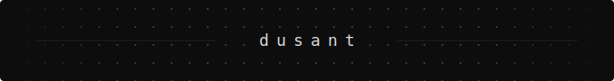

  

 

Generalist. I've got a curious spirit and I like learning unfamiliar codebases, connecting different technologies. The works.

I've got a fun background in enterprise production systems, which means I'm comfortable moving across various backend services, cloud infrastructures, automation, and developer tooling. Depending on what's needed, I can probably adapt to it quickly!

For a long time I kept most of my work private. A comfort zone I've grown quite fond of. This is me pushing past that.

I'm expanding into open-source contributions, technical writing, and side projects built in the open. Not because I have everything figured out, but because the discomfort of working in public is exactly where the growth is.

**Main stack**

`C#` &nbsp; `Python` &nbsp; `TypeScript` &nbsp;

**Current focus**

- C# / Python day-to-day
- MCP tooling in TypeScript
- Cloud & AI / LLM engineering
- open-source contributions
- building and writing in public

*Lovely to meet you!*

-Dusan

[LinkedIn](https://linkedin.com/in/dusan-trickovic) &nbsp;·&nbsp; [Email](mailto:dusan@dusant.dev)

